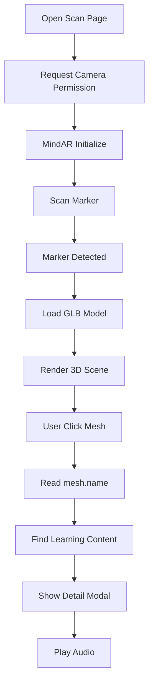

# AR System Documentation

# AR SDLC Learning Media

Version: 1.0

Status: Draft

Author: Bayu Dani Kurniawan

---

# 1. Overview

AR System merupakan inti dari aplikasi AR SDLC Learning Media.

Sistem ini memungkinkan pengguna melakukan scan marker menggunakan kamera perangkat untuk menampilkan model 3D SDLC yang dapat berinteraksi secara langsung.

Setiap tahapan pada model dapat dipilih sehingga pengguna dapat membaca materi pembelajaran serta mendengarkan audio penjelasan.

---

# 2. Technologies

AR System menggunakan:

- MindAR
- Three.js
- React Three Fiber
- GLTF Loader
- Raycaster
- WebGL
- Browser Camera API

---

# 3. AR Workflow



---

# 4. Marker Tracking

Marker Tracking menggunakan MindAR Image Tracking.

Setiap metode SDLC memiliki satu marker.

Contoh:

| Method    | Marker        |
| --------- | ------------- |
| Waterfall | waterfall.png |
| Agile     | agile.png     |
| RAD       | rad.png       |

Marker disimpan pada:

```
public/markers/
```

---

# 5. Model System

Setiap metode memiliki satu file GLB.

Contoh:

| Method    | Model         |
| --------- | ------------- |
| Waterfall | waterfall.glb |
| Agile     | agile.glb     |
| RAD       | rad.glb       |

Model disimpan pada:

```
public/models/
```

Model tidak disimpan di database.

---

# 6. Model Architecture

```mermaid
flowchart LR

Marker

-->

Method

-->

GLB Model

-->

Meshes

-->

Raycaster

-->

Popup
```

---

# 7. Mesh Architecture

Setiap tahapan harus dipisahkan menjadi mesh terpisah.

Contoh:

```
WF_REQUIREMENTS

WF_DESIGN

WF_IMPLEMENTATION

WF_TESTING

WF_DEPLOYMENT

WF_MAINTENANCE
```

Setiap mesh harus memiliki nama unik.

---

# 8. Mesh Naming Rules

Format:

```
PREFIX_STEP
```

Contoh:

Waterfall:

```
WF_REQUIREMENTS
WF_DESIGN
WF_IMPLEMENTATION
WF_TESTING
WF_DEPLOYMENT
WF_MAINTENANCE
```

Agile:

```
AG_PLANNING
AG_DAILY
AG_REVIEW
AG_RETRO
```

RAD:

```
RAD_REQUIREMENT
RAD_DESIGN
RAD_CONSTRUCTION
RAD_CUTOVER
```

Mesh name tidak boleh diubah setelah digunakan pada database.

---

# 9. Mesh Mapping

```mermaid
flowchart LR

MeshName

-->

Database

-->

Method Step

-->

Detail Modal
```

Contoh:

```
WF_REQUIREMENTS
```

↓

Database

↓

Requirements

↓

Popup

---

# 10. Blender Rules

Sebelum export GLB:

- Setiap tahapan harus dipisahkan.
- Nama mesh harus final.
- Jangan menggunakan nama otomatis seperti Cube001.
- Gunakan nama sesuai meshName database.
- Apply transform sebelum export.
- Hapus mesh yang tidak digunakan.

---

# 11. Export Rules

Format:

```
.glb
```

Gunakan:

- Binary GLTF

Gunakan compression bila diperlukan.

---

# 12. Click Interaction

User memilih objek menggunakan Raycaster.

```mermaid
flowchart TD

User Click

↓

Raycaster

↓

Intersect Object

↓

mesh.name

↓

Find Step

↓

Open Modal
```

---

# 13. Raycaster Rules

Raycaster hanya boleh mendeteksi mesh interaktif.

Mesh dekoratif tidak boleh memiliki event interaksi.

---

# 14. React State Flow

```mermaid
flowchart TD

Mesh Click

↓

Selected Step

↓

Global State

↓

Modal

↓

Audio Player
```

State global menggunakan:

- Zustand

---

# 15. Audio Flow

```mermaid
flowchart TD

Open Detail

↓

Check Audio

↓

Audio Exists?

↓

YES

↓

Play MP3

↓

NO

↓

SpeechSynthesis API
```

---

# 16. Browser Text To Speech

Jika audio tidak tersedia:

Gunakan:

```
SpeechSynthesis API
```

Sebagai fallback audio.

---

# 17. Performance Rules

- Load model hanya setelah marker terdeteksi.
- Jangan preload seluruh model sekaligus.
- Hindari render ulang yang tidak diperlukan.
- Gunakan cache bila memungkinkan.
- Ambil seluruh data tahapan dalam satu request.

---

# 18. Error Handling

Jika marker tidak terdeteksi:

Tampilkan:

```
Scan marker untuk memulai AR.
```

Jika kamera gagal diakses:

Tampilkan:

```
Izin kamera diperlukan.
```

Jika model gagal dimuat:

Tampilkan:

```
Gagal memuat model AR.
```

---

# 19. Future Features

Planned:

- AI Assistant
- Quiz
- Highlight Selected Mesh
- Mesh Animation
- Voice Question
- Multi Marker Tracking

---

# 20. Business Rules

- Satu metode memiliki satu marker.
- Satu metode memiliki satu model GLB.
- Satu metode memiliki banyak mesh.
- Setiap mesh mewakili satu tahapan.
- meshName harus sama dengan database.
- Mesh name tidak boleh diubah.
- Semua model menggunakan format GLB.
- Model tidak disimpan di database.

---

# 21. Definition of Done

AR feature dianggap selesai apabila:

- Marker berhasil terdeteksi.
- Model berhasil muncul.
- Seluruh mesh dapat diklik.
- Popup tampil sesuai mesh.
- Data sesuai database.
- Audio dapat diputar.
- Tidak terdapat TypeScript Error.
- Tidak terdapat console error.
