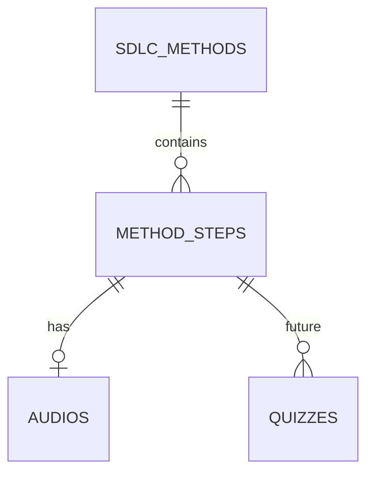
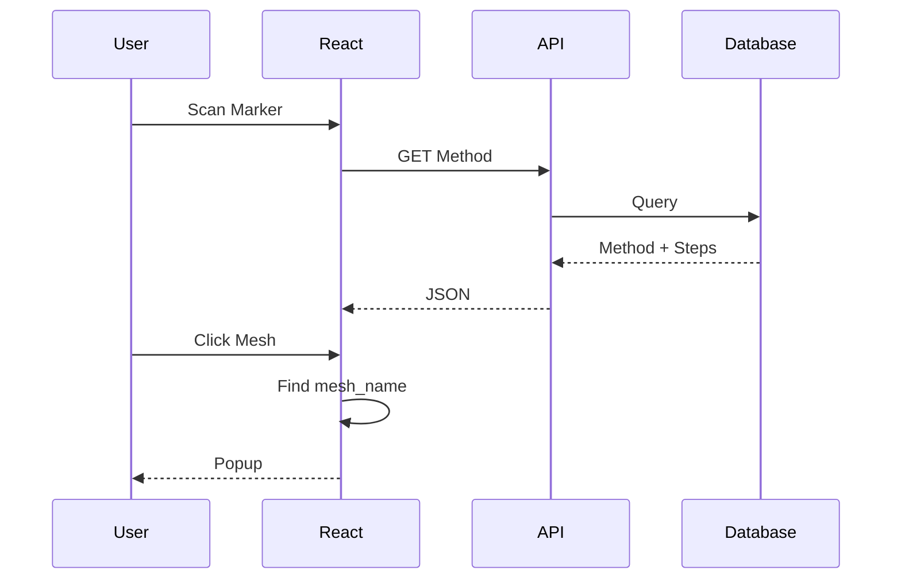

# Database Design

# AR SDLC Learning Media

Version: 1.0

Status: Draft

Author: Bayu Dani Kurniawan

---

# 1. Overview

Database digunakan untuk menyimpan seluruh konten pembelajaran yang bersifat dinamis.

Model 3D **tidak disimpan di database**.

Model GLB disimpan sebagai aset statis pada aplikasi.

Database hanya menyimpan informasi yang berkaitan dengan:

- Metode SDLC
- Tahapan
- Materi
- Audio

Pendekatan ini membuat ukuran database tetap kecil serta mempercepat proses rendering model AR.

---

# 2. Database Technology

Database

- Turso SQLite

ORM

- Drizzle ORM

---

# 3. Design Principles

Database dirancang berdasarkan beberapa prinsip berikut.

## Static Assets

Tidak masuk database.

- GLB
- Marker
- Texture

Lokasi:

```
public/models/

public/markers/
```

---

## Dynamic Content

Disimpan di database.

- Nama metode
- Deskripsi
- Tahapan
- Materi
- Audio

---

## Mesh Mapping

Setiap mesh pada model memiliki nama unik.

Contoh

```
WF_REQUIREMENTS

WF_DESIGN

WF_IMPLEMENTATION
```

Nama tersebut menjadi penghubung antara objek 3D dan data pembelajaran.

---

# 4. Entity Relationship Diagram



---

# 5. Database Schema

## SDLC_METHODS

Menyimpan informasi metode SDLC.

| Field       | Type      | Description             |
| ----------- | --------- | ----------------------- |
| id          | text (PK) | agile / waterfall / rad |
| name        | text      | Nama metode             |
| description | text      | Penjelasan singkat      |
| model_path  | text      | Lokasi file GLB         |
| marker_path | text      | Lokasi marker           |
| created_at  | timestamp | Created time            |
| updated_at  | timestamp | Updated time            |

---

Contoh

| id        | name      |
| --------- | --------- |
| waterfall | Waterfall |
| agile     | Agile     |
| rad       | RAD       |

---

## METHOD_STEPS

Menyimpan seluruh tahapan.

| Field       | Type        |
| ----------- | ----------- |
| id          | integer PK  |
| method_id   | FK          |
| mesh_name   | text UNIQUE |
| title       | text        |
| description | text        |
| step_order  | integer     |
| created_at  | timestamp   |
| updated_at  | timestamp   |

---

Contoh

| mesh_name         |
| ----------------- |
| WF_REQUIREMENTS   |
| WF_DESIGN         |
| WF_IMPLEMENTATION |

---

## AUDIOS

Menyimpan file audio.

| Field      | Type       |
| ---------- | ---------- |
| id         | integer PK |
| step_id    | FK         |
| audio_url  | text       |
| duration   | integer    |
| created_at | timestamp  |

Audio bersifat opsional.

Jika kosong maka Browser Text-to-Speech digunakan.

---

# 6. Future Tables

## QUIZZES

Digunakan pada versi berikutnya.

| Field          |
| -------------- |
| id             |
| step_id        |
| question       |
| option_a       |
| option_b       |
| option_c       |
| option_d       |
| correct_answer |

---

## CHAT_HISTORY

Future.

| Field      |
| ---------- |
| id         |
| question   |
| answer     |
| created_at |

---

# 7. Relationships

```
Method

│

├── Step 1

├── Step 2

├── Step 3

└── Step N
```

Setiap Method memiliki banyak Step.

---

```
Step

│

└── Audio
```

Setiap Step maksimal memiliki satu Audio.

---

```
Step

│

├── Quiz 1

├── Quiz 2

└── Quiz N
```

Quiz merupakan fitur pengembangan.

---

# 8. Data Flow

Saat user melakukan scan.

```
Marker

↓

Method

↓

Load Model

↓

GET Method + Steps

↓

React State
```

Ketika user memilih salah satu tahapan.

```
Mesh Click

↓

mesh.name

↓

Find Step

↓

Popup

↓

Audio
```

Tidak ada request database kedua.

---

# 9. Mesh Mapping

Contoh mapping.

| Mesh Name         | Database       |
| ----------------- | -------------- |
| WF_REQUIREMENTS   | Requirements   |
| WF_DESIGN         | Design         |
| WF_IMPLEMENTATION | Implementation |
| WF_TESTING        | Testing        |
| WF_DEPLOYMENT     | Deployment     |
| WF_MAINTENANCE    | Maintenance    |

---

Agile

| Mesh        |
| ----------- |
| AG_PLANNING |
| AG_DAILY    |
| AG_REVIEW   |
| AG_RETRO    |

---

RAD

| Mesh             |
| ---------------- |
| RAD_REQUIREMENT  |
| RAD_DESIGN       |
| RAD_CONSTRUCTION |
| RAD_CUTOVER      |

---

# 10. Request Flow



---

# 11. Business Rules

- Setiap metode memiliki satu model GLB.
- Setiap metode memiliki satu marker.
- Setiap metode memiliki banyak tahapan.
- Setiap tahapan memiliki mesh_name yang unik.
- mesh_name harus sama dengan nama mesh pada Blender.
- Admin tidak dapat mengubah mesh_name.
- Admin hanya dapat mengubah konten pembelajaran.
- Audio bersifat opsional.
- Jika audio kosong maka Browser Speech Synthesis digunakan.

---

# 12. Example JSON

Method

```json
{
  "id": "waterfall",
  "name": "Waterfall",
  "modelPath": "/models/waterfall.glb",
  "markerPath": "/markers/waterfall.png"
}
```

Step

```json
{
  "id": 1,
  "methodId": "waterfall",
  "meshName": "WF_REQUIREMENTS",
  "title": "Requirements",
  "description": "Tahapan untuk mengumpulkan kebutuhan sistem.",
  "stepOrder": 1
}
```

---

# 13. Database Optimization

- Menggunakan Turso SQLite.
- Satu request mengambil seluruh tahapan berdasarkan metode.
- Detail tahapan disimpan pada React State.
- Tidak melakukan query setiap kali mesh diklik.
- mesh_name menggunakan UNIQUE INDEX.

---

# 14. Summary

Database menggunakan pendekatan **Static Asset + Dynamic Content**.

Model 3D menjadi bagian dari aplikasi, sedangkan database hanya menyimpan informasi pembelajaran. Hubungan antara objek 3D dan database dilakukan melalui `mesh_name`, sehingga interaksi AR dapat dilakukan secara cepat tanpa perlu menyimpan informasi pembelajaran di dalam file `.glb`.
